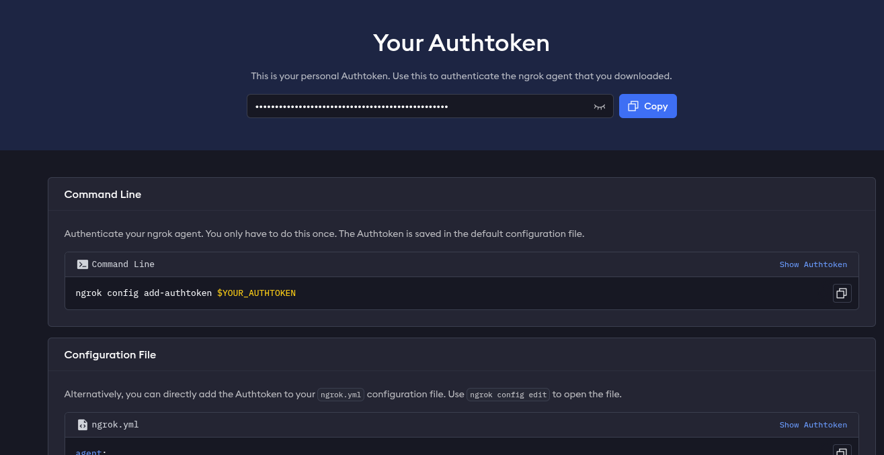
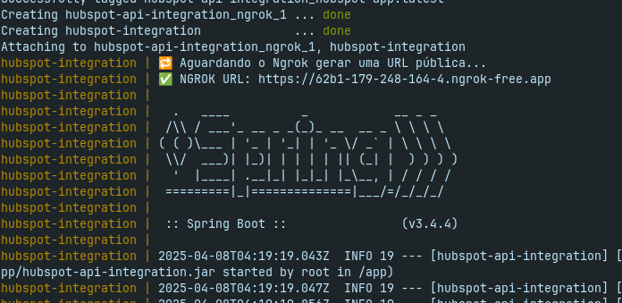
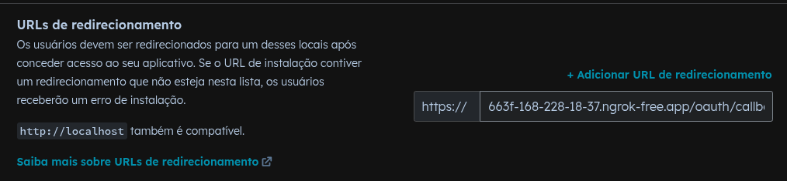

🔗 Integração com HubSpot - Desafio Técnico

🎯 Objetivo
Este projeto implementa uma API REST em Java com Spring Boot para integração com a API do HubSpot, utilizando o fluxo OAuth 2.0 (Authorization Code Flow).

    ✅ Funcionalidades
    🔑 Geração da URL para autenticação OAuth com o HubSpot

    🔁 Recebimento do callback OAuth e troca do authorization code por access token

    📝 Criação de contatos no CRM HubSpot

    📩 Recebimento de notificações via Webhook (ex: contact.creation)

    🧠 Armazenamento dos eventos recebidos em banco H2 em memória

    ⚙️ Tecnologias Utilizadas
    Ferramenta
    Java	   
    Spring Boot
    Maven
    Ngrok
    Docker
    Docker Compose

📁 Documentação de Apoio

📄 Link para decisões e arquitetura do projeto: [decisões e explicações técnicas](docs/reports/report.md)

🧪 Como Rodar os Testes
Para rodar os testes unitários:

~~~bash
mvn test
~~~

🔐 Configuração do HubSpot
Crie uma conta de desenvolvedor no HubSpot:
👉 https://developers.hubspot.com

Crie um aplicativo e copie:

client_id

client_secret

Configure as seguintes variáveis no seu arquivo .env:

~~~env
HUBSPOT_CLIENT_ID=<seu_client_id>
HUBSPOT_CLIENT_SECRET=<seu_client_secret>
NGROK_AUTHTOKEN=<seu_ngrok_token>
~~~

Você pode obter seu token do Ngrok em:
👉 https://dashboard.ngrok.com/get-started/your-authtoken

🐳 Executando com Docker Compose

1. Gere o JAR da aplicação

~~~bash
mvn package
~~~

Este comando já executa os testes automaticamente.

2. Suba os serviços com o Docker Compose
~~~bash
docker-compose up --build
~~~

Isso irá:

Iniciar a aplicação

Criar um túnel com o Ngrok

Expor a API publicamente (essencial para receber webhooks do HubSpot)

3. Acompanhe o log e copie a URL do Ngrok
Exemplo:

~~~text
https://62b1-179-248-164-4.ngrok-free.app
~~~

🔄 Configuração de OAuth e Webhook no HubSpot

🔗 URL de Callback
Copie a URL do Ngrok e registre no painel do HubSpot:

~~~text
https://<seu-ngrok>.ngrok-free.app/oauth/callback
~~~

📩 URL do Webhook
Exemplo de webhook para evento contact.creation:

~~~text
https://<seu-ngrok>.ngrok-free.app/hubspot/webhook
~~~

🚀 Fluxo de Autenticação e Criação de Contato

1. Obter a URL de autenticação OAuth
~~~bash
GET /oauth/url
~~~

Retorna a URL para autenticação do usuário no HubSpot.

2. Callback com code
Após autenticar, o HubSpot redireciona para o /oauth/callback com um code (Navegador).

A aplicação irá automaticamente trocá-lo por um access token.

Esse token deve ser usado nas requisições para criação de contatos.

3. Criar Contato
~~~bash
POST /crm/contacts
~~~
Headers:
~~~makefile
Authorization: Bearer <access_token>
~~~

Body:
~~~json
{
  "email": "example@gmail.com",
  "firstname": "Tester",
  "lastname": "Testing"
}
~~~

Resposta de sucesso:

~~~text
201 Created
Usuário criado com sucesso!
~~~

Exemplo de erro (token expirado):
~~~json
{
  "timestamp": "2025-04-08T04:30:19.053402754Z",
  "error": "error",
  "message": "the oauth token used to make this call expired 6 hour(s) ago.",
  "source": "Hubspot"
}
~~~

🔔 Exemplo de Payload de Webhook Recebido
~~~json
{
  "appId": 10468552,
  "eventId": 100,
  "subscriptionId": 3422102,
  "portalId": 49638027,
  "occurredAt": 1744086192843,
  "subscriptionType": "contact.creation",
  "attemptNumber": 0,
  "objectId": 123,
  "changeSource": "CRM",
  "changeFlag": "NEW"
}
~~~

Esse conteúdo será salvo no banco em memória (H2).

🗃️ Acessando o Banco de Dados
Acesse o console H2:

~~~ text
http://localhost:8080/h2-console
Configuração:
JDBC URL: jdbc:h2:mem:testdb
~~~

Username: sa

Senha: (em branco)

🧼 Dicas de Troubleshooting
Se ocorrer erro na imagem Docker após alterações:

~~~ bash
docker system prune -af
docker-compose up --build
~~~