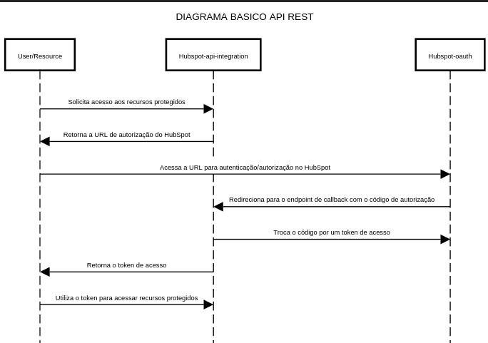

# 🔗 Integração com HubSpot - Desafio Técnico

## 🎯 Objetivo

Este projeto implementa uma API REST em Java com Spring Boot para integração com a API do HubSpot, utilizando o fluxo OAuth 2.0 (Authorization Code Flow).

### Funcionalidades atuais

✅ Geração de URL para autenticação OAuth com o HubSpot  
⬜️ Recebimento do callback OAuth e troca do authorization code por access token  
⬜️ Criação de contatos no CRM HubSpot  
⬜️ Recebimento de notificações via webhook (ex: contact.creation)

---

## ⚙️ Tecnologias e Versões

| Ferramenta     | Versão   |
|----------------|----------|
| Java           | 21       |
| Spring Boot    | 3.4.4    |
| Maven          | 3.9.9    |
| Ngrok (testes) | Opcional |

---

## 💡 Considerações inicias

Antes de iniciar o projeto, me preocupei bastante em entender como funcionaria todo o fluxo da aplicação e como seria feita a entrega. Com entrega, quero dizer garantir a disponibilidade e a facilidade de execução da aplicação. Minha intenção é que ela seja dockerizada, permitindo fácil uso e configuração, inclusive no que diz respeito às variáveis de ambiente e outros recursos necessários.

Outro ponto que considerei desde o início foi a possível utilização de um banco de dados de cache, como o Redis. Essa ideia surgiu principalmente pensando na manipulação de tokens e também em um possível uso futuro no quarto requisito, relacionado ao recebimento de notificações.

Tendo isso em mente e com um caminho bem definido, decidi começar pelo básico: implementar o fluxo de requisitos de forma funcional e com qualidade. As melhorias e otimizações, como o uso de cache, ficarão para etapas mais avançadas do projeto.

## 🔖 Diagrama de sequencia (Simples) para mapeamento do fluxo

Criei esse diagrama em: https://sequencediagram.org/

## 📌 Etapa 1: Geração da Authorization URL

### ✅ Descrição

Implementado endpoint responsável por gerar e redirecionar o usuário para a URL de autorização do HubSpot. Essa etapa inicia o fluxo OAuth 2.0 e permite ao usuário conceder permissões ao aplicativo.

### 📥 Endpoint

GET /oauth/authorize-url

💭 Estratégia para Implementação
O desenvolvimento deste endpoint foi focado em atender ao primeiro requisito do desafio técnico: gerar a URL de autorização do HubSpot para dar início ao fluxo de autenticação OAuth 2.0. Levei em consideração algumas boas práticas de segurança, como:

Evitar exposição de chaves sensíveis, mantendo-as configuráveis via variáveis de ambiente, tanto para desenvolvimento quanto para produção.

Criação de um controller dedicado ao fluxo de OAuth, responsável por atender ao primeiro e segundo requisitos do desafio. Essa separação tem como objetivo garantir clareza no código e facilitar a manutenção futura.

Além disso, optei por criar um Record para representar o modelo de resposta da URL de autorização. Essa abordagem permite flexibilidade, facilitando a personalização da resposta, caso seja necessário.

No processamento do endpoint, utilizei o UriComponentsBuilder para a construção da URL. Essa ferramenta torna o código mais legível e facilita a adição de novos parâmetros, se necessário.

Exemplo de Resposta do Endpoint

~~~json
  {
    "authorizationUrl": "https://app.hubspot.com/oauth/authorize?    client_id=xyz&redirect_uri=https://host/callback&scope=crm.objects.contacts.read"
  }
~~~